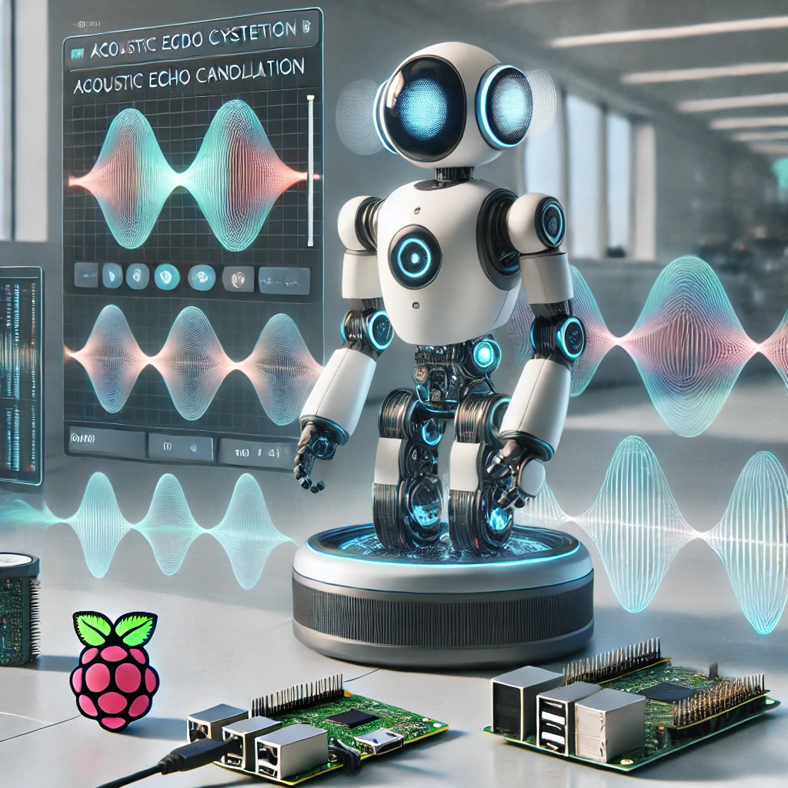

# Python Acoustic Echo Cancellation Library



## Overview
This repository implements classic **adaptive filters**—LMS, NLMS, and RLS—geared toward real-time **Acoustic Echo Cancellation (AEC)**, noise reduction, and general audio DSP.

| Filter | Highlights |
|--------|------------|
| **LMS**  | Lightweight; now supports a `safe` mode that clips extreme error values to prevent numeric overflows. |
| **NLMS** | Normalises step size per block ⇒ faster, stabler convergence. |
| **RLS**  | Uses an inverse correlation matrix for very rapid adaptation. |

---

## Installation
```bash
pip install numpy scipy matplotlib sounddevice   # sounddevice is needed for the live demo
````

> ⚠️ The package is source-only for now—just clone and import:

```bash
git clone https://github.com/Keyvanhardani/Python-Acoustic-Echo-Cancellation-Library.git
cd Python-Acoustic-Echo-Cancellation-Library
```

---

## Quick Start

### 1 · Run the built-in demo

```bash
python lms.py     # picks the best μ and prints the total error
```

### 2 · Live AEC over mic + speaker

```bash
python mic_demo.py    # press Ctrl-C to stop
```

You’ll hear your own voice while the loud-speaker echo is strongly attenuated.

---

## API Examples

### LMS (with `safe=True`)

```python
from lms import lms_filter
import numpy as np

d = np.random.randn(10_000).astype(np.float32)  # desired signal
u = np.random.randn(10_000).astype(np.float32)  # reference (echo path)
f0 = np.zeros(1024, dtype=np.float32)           # initial coeffs
mus = [1e-4, 5e-4, 1e-3]

e, f_adapt, best_mu = lms_filter(
        desired_signal=d,
        reference_input=u,
        filter_coeff=f0,
        step_sizes=mus,
        safe=True        # clips |e| ≤ 1e4 → no RuntimeWarnings
)
```

### NLMS

```python
from nlms import nlms_filter
e, f_adapt = nlms_filter(d, u, f0, mu=0.5)
```

### RLS

```python
from rls import rls_filter
e, f_adapt = rls_filter(d, u, f0, reg_param=0.1, lambda_=0.98)
```

---

## Batch AEC: WAV → filtered WAV

```python
import scipy.io.wavfile as wav
from lms import lms_filter
import numpy as np

fs, y = wav.read("input.wav")        # y is int16
x = y.astype(np.float32) / 32768.0   # scale to ±1

e, *_ = lms_filter(x, x, np.zeros(1024), [5e-4], safe=True)

wav.write("output.wav", fs, np.int16(e / np.max(np.abs(e)) * 32767))
```

---

## Visualising the Result

```python
import matplotlib.pyplot as plt
plt.plot(x,   label="Original")
plt.plot(e,   label="AEC output", alpha=0.7)
plt.legend(); plt.show()
```

---

## Live Demo Options

| Flag    | Description                           | Default   |
| ------- | ------------------------------------- | --------- |
| `BLOCK` | FFT/block length (also filter length) | 1024      |
| `FS`    | Sample rate                           | 48 000 Hz |
| `MU`    | Step size                             | 5 × 10⁻⁴  |

Adjust them directly at the top of **`mic_demo.py`**.

---

## Contributing

1. Fork & create a feature branch.
2. Run `python lms.py` and `python mic_demo.py`—there must be **zero warnings**.
3. Submit a PR with a clear description.

---

## License

MIT

```

